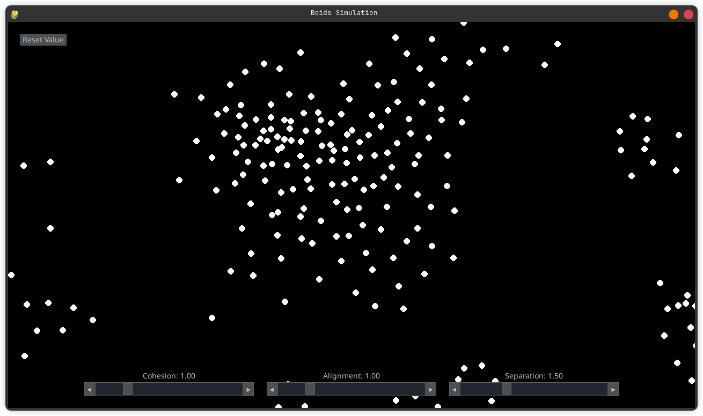

# Boids(Flocking) Simulation
A Boid/Flocking simulation for Code In Place 2025 Final Project written in Python

## Dependencies
- pygame-ce v2.5.5
- pygame-gui v0.6.14

## How to run
Clone the repository
```bash
git clone git@github.com:Grydr/flocking-simulation.git
cd flocking-simulation
```

If you have all the dependencies installed
```bash
python main.py
```

or if you have [uv](https://github.com/astral-sh/uv "Python uv") installed
```bash
uv sync
source .venv/bin/activate
python main.py
```
or
```bash
uv run main.py
```

## TODO
* [ ] change boids shape
* [ ] implement trailing line
* [ ] color 1 random boids as the main character(?)

### Credit to
[@The Coding Train videos](https://www.youtube.com/watch?v=mhjuuHl6qHM&t=127s) on flocking algorithm

[@Ben Eater](https://eater.net/boids) for inspiring this little project

[@Craig Reynolds](https://dl.acm.org/doi/10.1145/37401.37406) as the developer of this algorithm
